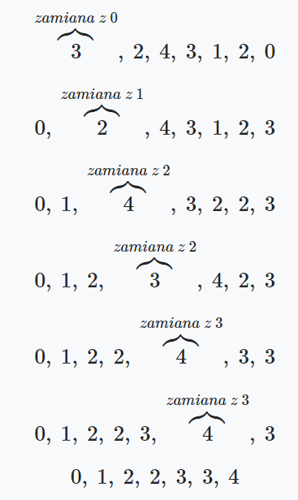

# Programming-course-cpp

`Jakub Piskorowski on 05/05/2022 wersja: 1.0`

## Temat: Sortowanie przez wybieranie

Przedstawienie działania algorytmu sortowania przez wybieranie

Kod źródłowy:
[sortowanie-wybieranie.cpp](sortowanie-wybieranie.cpp)

 `Poziom 3`

Powrót do [Algorytmy sortowania](/2-algorytmika/2-4-algorytmy-sortowania/README.md)

---

## Objaśnienie

Strategia **sortowania przez wybór** jest bardzo prosta. **Szukamy najmniejszego elementu w zbiorze i zamieniamy go z elementem stojącym na pozycji pierwszej.** Następnie szukamy znowu elementu najmniejszego w zbiorze pominiętym o pierwszy element i wstawiamy go na pozycję drugą. Czynności powtarzamy do momentu otrzymania jednoelementowego podzbioru. Rozpatrzmy przykład liczb:

```text
3, 2, 4, 3, 1, 2, 0
```

Przeanalizujmy porządkowanie tych liczb metodą przez selekcję:



<!-- Źródło: [algorytm.edu.pl](http://www.algorytm.edu.pl/algorytmy-maturalne/sortowanie-przez-selekcje-wybieranie.html) -->

---

## Implementacja

**Wejście:** \
`tab` - tablica z losowymi wartościami liczb całowitych \
`n` - rozmiar tablicy

**Zmienne pomocnicze:** \
`index` - zmienna przechowująca indeks komórki z minimalną wartością \
`val` - zmienna pomocnicza do zamiany elementów

**Lista kroków:**\
K1: &emsp; `Dla i = 0,1,... n-1` &emsp; Pętla, która przechodzi przez elementy tablicy \
&emsp; &emsp; &emsp; &emsp; `wykonuj kroki od K2 do K6` \
K2: &emsp; `Dla j = i+1,...,n` &emsp; Pętla wyszukuje najmniejszy element w zbiorze \
&emsp; &emsp; &emsp; &emsp; `wykonuj krok K3` \
K3: &emsp; `Jeżeli tab[j] < tab[index]` \
&emsp; &emsp; &emsp; &emsp; `to index = j`

K4: &emsp; `val ← tab[i]` &emsp; zamiana najmniejszego elementu z pierwszą pozycją nieposortowaną \
K5: &emsp; `tab[i] = tab[index]` \
K6: &emsp; `tab[index] = val`

Wynik działania programu:

```text
Wprowadz liczbe elementow do posortowania: 10

Tablica przed posortowaniem:
72 | 41 | 1 | 97 | 20 | 31 | 72 | 35 | 11 | 74 |

Rozpoczecie sortowania

Tablica po sortowaniu:
1 | 11 | 20 | 31 | 35 | 41 | 72 | 72 | 74 | 97 |
```

Kod źródłowy: [sortowanie-wybieranie.cpp](sortowanie-wybieranie.cpp)
